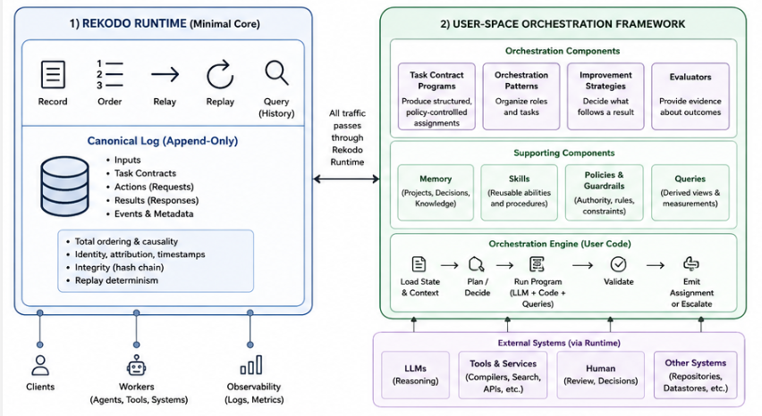

# Rekodo 

Minimal, improvable orchestration for multi-agent runs. Every run recorded and the next run improved.

Rekodo combines a minimal runtime core with an extensible user-space orchestration framework. 

> [!NOTE]
> This project is in progress. Once an alpha version is completed, the execution code will be published. 

## Core Foundation

Agent context is temporary; Rekodo’s record is not. Even after context compression or restart, the assignments, decisions, and results that pass through Rekodo remain available in one ordered history.

The minimal runtime records, orders, relays, and replays that history. A replaceable user-space orchestrator decides what happens next and may use Task Contract Programs, orchestration patterns, evaluators, memory, skills, and improvement strategies without changing the runtime.

At cold start, Rekodo has no run-derived memory or learned skills. Improvement begins when evaluated findings are explicitly accepted and carried into later runs.

See [Foundation](docs/arch/foundation.md) for the complete design principles.

## Architecture

Rekodo has two architectural layers: the **Rekodo Runtime** and the **Rekodo Orchestrator**. 


(By GPT-5.6-sol) 

### Rekodo Runtime

The Rekodo Runtime remains deliberately unintelligent. It understands only
generic execution information and is responsible for:

- recording an input before making it available to orchestration;
- recording a Task Contract before delivering it to its declared worker;
- recording a result before relaying it to orchestration;
- assigning a canonical order to recorded events;
- mediating and recording every nondeterministic observation that can affect a
  Run Program;
- supplying recorded observations instead of contacting live external systems
  during replay;
- preserving and exposing the canonical history.

The runtime does not select tasks or workers, interpret project contracts,
construct worker assignments, evaluate results, or decide what happens next.
It records, orders, and relays the execution chosen by the orchestrator.

A replayable Run Program must not obtain execution-relevant time, randomness,
network responses, model outputs, tool results, human input, or mutable
environment state outside Rekodo’s recorded boundary.

### Rekodo Orchestrator

Rekodo provides a default orchestrator as a separate user-space component. It is replaceable: applications may extend it or bring their own orchestrator as long as they use the Rekodo Runtime protocol.

The orchestrator may combine ordinary program logic with commercial, open-source, or local LLMs. Each run records the orchestrator implementation, version, configuration, and the versions of its selected Task Contract Programs, patterns, strategies, and evaluators.

For provenance, a run may record the orchestration framework and component versions that produced its Run Program. Replay depends on the recorded Run Program and its compatible execution environment.

The orchestration framework separates four areas of capabilities:

- [Task Contract Programs](docs/arch/task-contract-programs.md) — Produce structured, policy-controlled assignments for agents and tools.
- [Orchestration Patterns](docs/arch/orchestration-patterns.md) — Organize roles and tasks into sequential, iterative, or parallel work.
- [Improvement Strategies](docs/arch/improvement-strategy.md) — Decide what should follow a result, such as acceptance, critique, verification, revision, or escalation.
- [Evaluators](docs/arch/evaluators.md) — Supply evidence about correctness, quality, completion, cost, or latency.


### Run Programs and Replay

The Rekodo Orchestration Framework produces an executable Run Program for each run. Rekodo records the exact Run Program, its configuration, and its inputs before execution.

A Run Program is deterministic with respect to its recorded history: every external observation that can affect execution must pass through Rekodo. During a live run, Rekodo records observations such as time, randomness, model responses, tool results, human input, and mutable environment state. During replay, Rekodo supplies those recorded observations instead of contacting the live external systems again.

Given the same Run Program and recorded history, replay follows the same execution path. The original orchestration framework may be recorded for provenance or regeneration, but it is not a replay dependency.

Executing the same Run Program against live models, tools, humans, or other external systems is a rerun, not a replay, and may produce different results.

### An Example Run

Here is the simplest run example using Rekodo runtime and Orchestration capabilities: 

```text
User submits a task
        ↓
Runtime records the input
        ↓
Orchestrator selects a worker and orchestration pattern
        ↓
Task Contract Program produces a controlled assignment
        ↓
Runtime records and delivers the Task Contract
        ↓
Worker performs the assignment and returns a result
        ↓
Runtime records and relays the result
        ↓
Evaluator supplies evidence
        ↓
Improvement strategy accepts, revises, retries, escalates, or completes
```

The orchestrator decides what happens. The runtime records and relays what happens.


